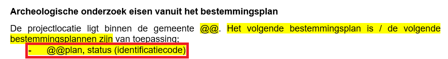

**Dubbelbestemmingen Archeologie**
1. Ga naar  [https://omgevingswet.overheid.nl/regels-op-de-kaart/zoeken/locatie](https://omgevingswet.overheid.nl/regels-op-de-kaart/zoeken/locatie)
2. Voer het adres in.
3. Als er een apart bestemmingsplan voor archeologie bestaat, kies dit bestemmingsplan. Kies anders het meest recente vastgestelde algemene bestemmingsplan.
4. Klik in het paneel rechts op kenmerken.
5. Vul in:
	- Voer plan de naam van het plan.
	- Voer status de status zonder haakjes.
	- Voer identificatiecode de code zonder identificatie.
6. Herhaal de stappen 2 t/m 5 voor een ander bestemmingsplan dat doorkruist wordt door het Tracé.

