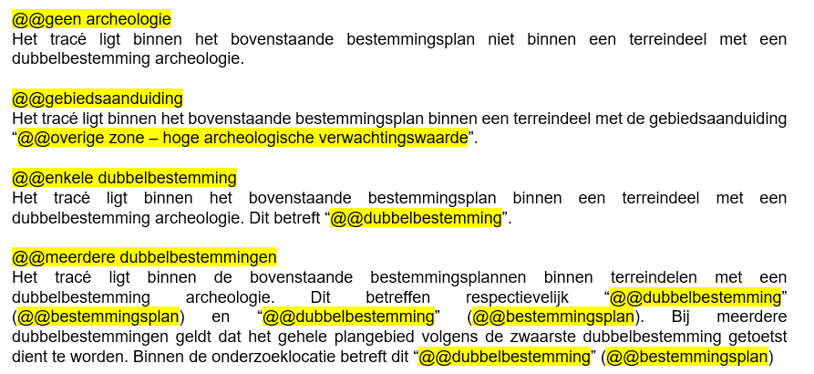
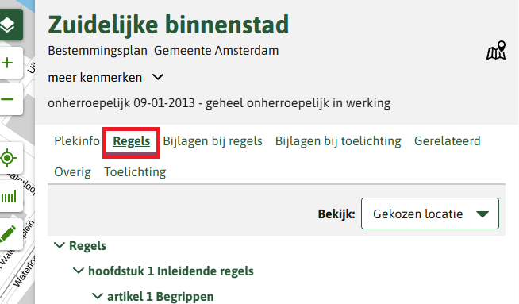
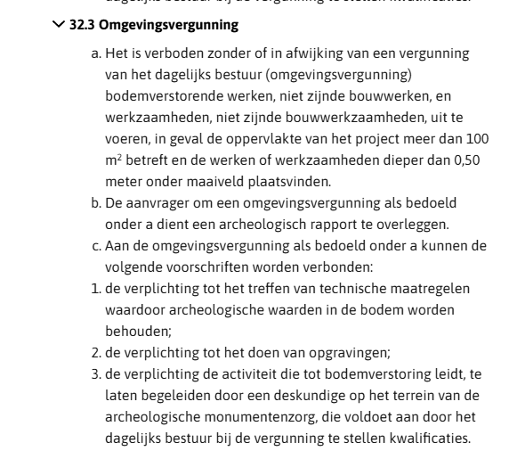

**Regels**
1. Kies de juiste tekst voor het aantal dubbelbestemmingen.

2. Open de regels van de dubbelbestemming met de hoogste waarde archeologie.

3. Zoek in de bouwregels naar regels relevant voor de graafwerkzaamheden met ontgravingsdiepte en lengte van het tracé. Vaak staat er iets als "werkzaamheden geen bouwwerk zijnde" in de op en "aanleggen van leidingen" in de lijst van werkzaamheden (zie plaatje hieronder). De regels kunnen bevatten:
	- A. een **verbod** geldend voor een oppervlakte **en** diepte (met alleen een overschrijding van de diepte geldt het verbod niet)
	- B. een **verbod** geldend voor een oppervlakte **of** diepte (met alleen een overschrijding van de diepte geldt het verbod wel)
	- C. een **uitzondering op het verbod** voor een maximale diepte **en** maximale oppervlakte (met alleen een overschrijding van de diepte geldt het verbod niet)
	- D. een **uitzondering op het verbod** voor een maximale diepte **of** maximale oppervlakte (met alleen een overschrijding van de diepte geldt de uitzondering)
4. Vul de tekst in:
	- Gebruik voor 3a en 3b alleen de eerste paragraaf en verwerk de voorwaarden erin.
	- Werkzaamheden zijn vaak het aanleggen van leidingen.

