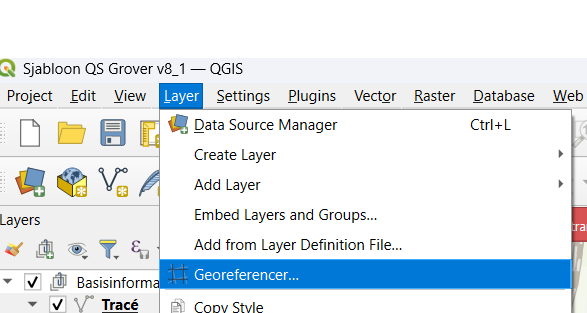
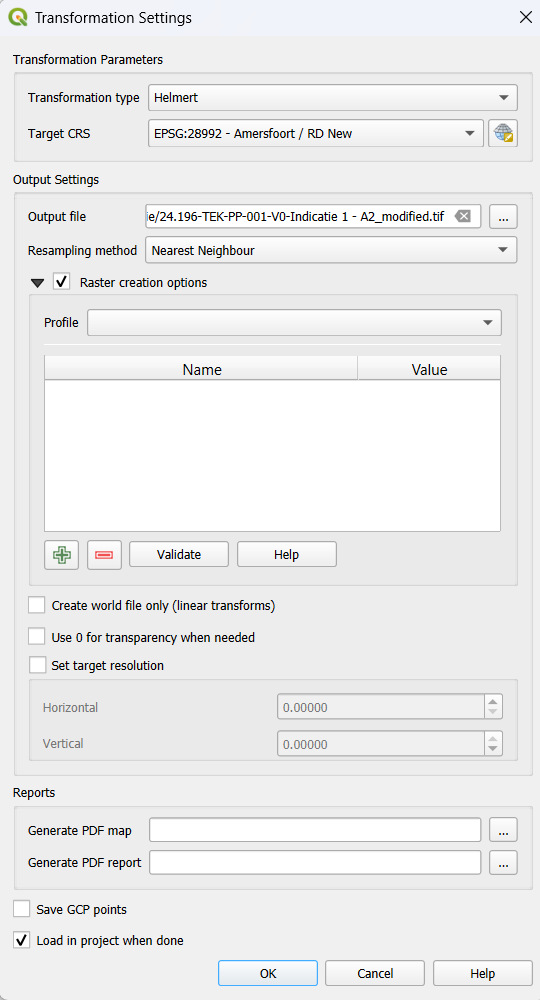
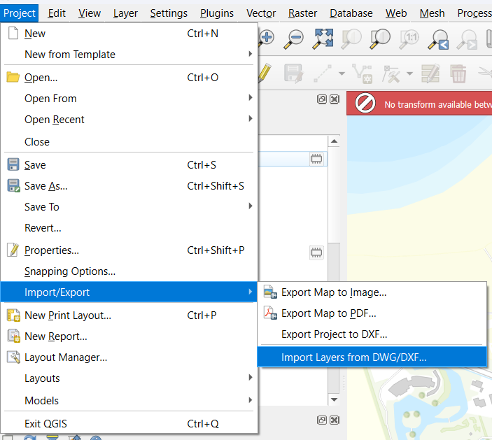
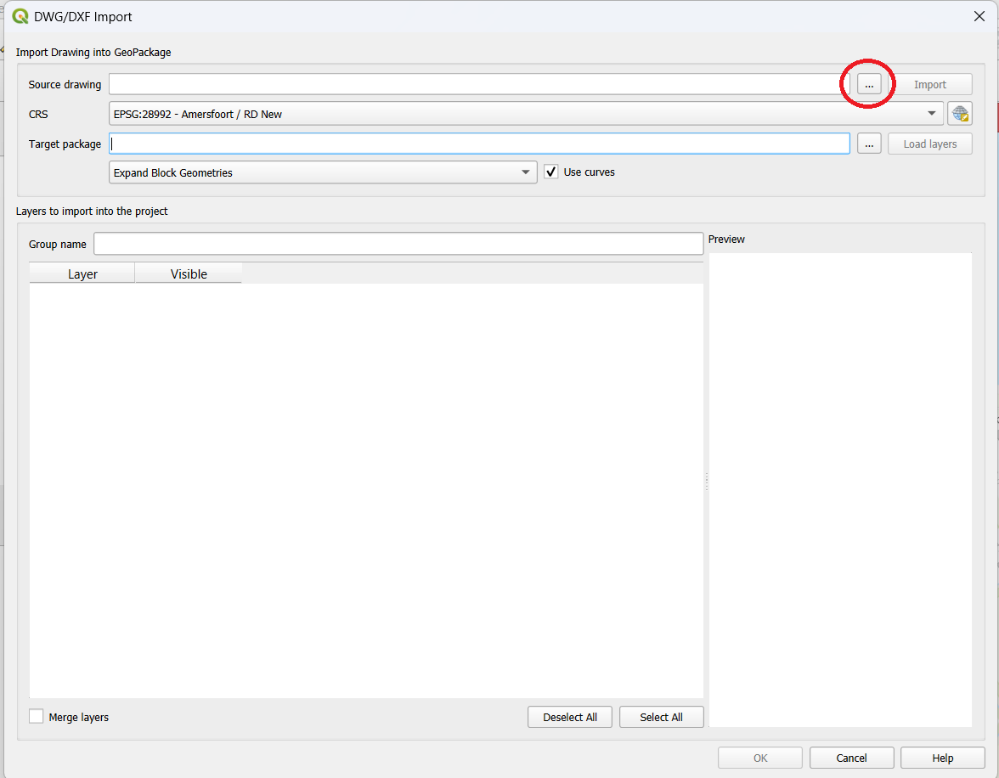

**Kop**
1. Open QGIS met het meest up-to-date Sjabloon.
2. Kijk of we de shapefiles van het project tracé in Basisinformatie hebben meegekregen.

- Als het een trace is zou het er zo uit moeten zien. Heb je die? Ga naar stap 3.

- Hebben we geen shapefiles? Kijk dan of we een PDF hebben. Ga naar stap 4 als we die hebben.

- Staat er geen PDF bestand of shapefiles maar wel een .dwg of .dxf bestand? Ga naar stap 8. Als deze er ook niet in staan, vraag aan onze Ortageo contactpersoon of die ergens staan.

3. Sleep de SHP files uit Basisinformatie > SHP in QGIS (Drag and drop). Dit zet deze lagen in QGIS.
- De trace staat nog niet onder de tracé laag, deze gaan we in de volgende stap overtekenen.
- Ga naar stap 10.

4. Ga naar Layer > Georeferencer in de menubalk van QGIS.

5. Klik op "Open Raster" en laad de PDF van het trace in.

6. We gaan deze PDF nu op de kaart zetten met behulp van referentie punten.
- Klik op een punt op de PDF, je krijgt nu een scherm met "Enter Map Coordinates" te zien.
- Klik hier op "From Map Canvas".
- Klik op het punt wat hiermee overeenkomt op de kaart, wees zo accuraat mogelijk. Je krijgt het "Enter Map Coordinates" scherm weer te zien, deze keer met de map coordinaten ingevoerd. Klik op "Ok.
- Herhaal dit tot je minstens 4 verschillende punten hebt. Als je een fout hebt gemaakt, kan je individuele punten verwijderen door met je rechtermuisknop op die coordinaten op de "GCP table" te klikken en dan "Remove".

7. Klik op "Start Georeferencing", de groene "play" knop.
- Je krijgt een prompt om "Set Output File Name" in te voeren. Klik op OK.
- Je krijgt nu de "Transformation Settings" te zien, die moeten er zo uit zien;

- Klik op OK.
- Klik nogmaals op de "Start Georeferercing" knop.
- De PDF zou nu goed georienteerd op de kaart moeten staan. Kan je deze niet zien?  Kijk of hij onder een andere laag zit.
- Ga nu naar stap 10.

8. Ga naar Project > Import/Export > Import Layers from DWG/DXF...

9. Selecteer het .dwg .dwx bestand door op de "..." knop bij "Source Drawing" te klikken.

- Klik op "Import". (Als je een foutmelding krijgt dat het bestand niet gesupport wordt zoals bivoorbeeld "Cannot read AutoCAD 2018/2019/2020...", moet deze waarschijnlijk geconvert worden naar een oudere versie van autocad. Bijvoorbeeld door een tool zoals "ODA File Converter".)
- Klik op OK.
- Het geimporteerde bestand staat nu onderaan de kaartlagen, sleep deze naarboven.
- Ga nu naar stap 10.

10. Het tracé staat op de kaart, maar nog niet onder de "Tracé" laag. Om dit over te tekenen selecteren we de volgende tools;

11. Selecter de kaartlaag "Tracé" en linker muisklik op het begin punt van het tracé, en volg deze met meerdere selecties. Rechtermuisklik om te eindigen. Je krijgt een pop-up waar de lengte van de huidige lijn, en waaronder deze opgeslagen moet worden. Selecteer hier "Open Ontgraving".


Bij erg lange Tracés is het handig om  het vaker te eindigen voor het geval iets fout gaat.


12. **Lengte Berekenen**
- Selecteer "Open Ontgraving" en rechtermuisknopklik > “Attributentabel openen” , dit opent een nieuw venster.
- De lengtes van de verschillende getekende lijnen verschijnen nu in cm.
- Tel deze lengtes op en vul deze in meters in boven afbeelding 1 in de Memo, zie afbeelding hieronder.

