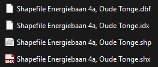
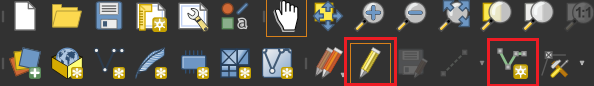
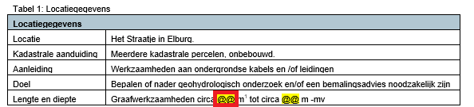

**Kop**
1. Open QGIS met het meest up-to-date Sjabloon.
2. Kijk of we de shapefiles van het project tracé in Basisinformatie > SHP hebben meegekregen. Dat zou er zo uit moeten zien;

- Staan deze er? Ga dan verder naar stap 3.
- Staan deze er niet? Ga dan naar stap 7.

3. Sleep de SHP files uit Basisinformatie > SHP in QGIS (Drag and drop). Dit zet deze lagen in QGIS.
4. Als het goed is staat het Tracé nu in QGIS, maar staat niet onder de laag Tracé > Open Ontgraving. Om dit over te tekenen selecteren we de volgende tools;

5. Selecter de kaartlaag "Tracé" en linker muisklik op het begin punt van het tracé, en volg deze met meerdere selecties. Rechtermuisklik om te eindigen. Je krijgt een pop-up waar de lengte van de huidige lijn, en waaronder deze opgeslagen moet worden. Selecteer hier "Open Ontgraving".


Bij erg lange Tracés is het handig om  het vaker te eindigen voor het geval iets fout gaat.


6. **Lengte Berekenen**
- Selecteer "Open Ontgraving" en rechtermuisknopklik > “Attributentabel openen” , dit opent een nieuw venster.
- De lengtes van de verschillende getekende lijnen verschijnen nu in cm.
- Tel deze lengtes op en vul deze in meters in boven afbeelding 1 in de Memo, zie afbeelding hieronder.

7. 

