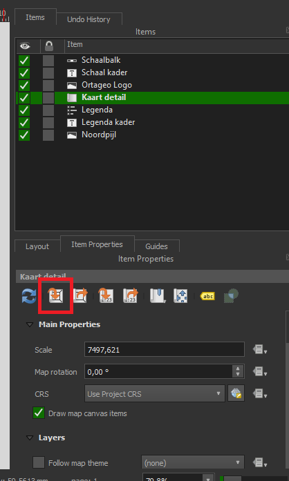
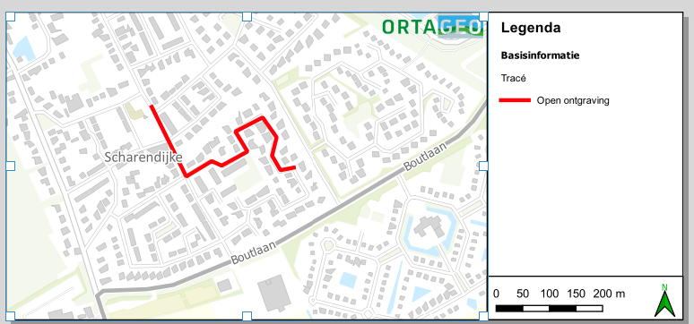

**Afbeelding werkzaamheden genereren**
- Ga naar “Project”> “Layouts”>”Ortageo langwerpig Zonder Overzichtskaart”, dit opent venster.
- Selecteer “Kaartdetail”   en vervolgens “Kaartbereik instellen op bereik van kaartvenster” .

- Pas zo nodig de kaart aan (linker lint) zodat de werkzaamheden in centraal staan.
- Ga naar “Lay-out”>”Als afbeelding exporteren”.
- Plaats de afbeelding in plaats van het logo bij “Afbeelding 1” in de Memo.
- Houd dit venster open.

