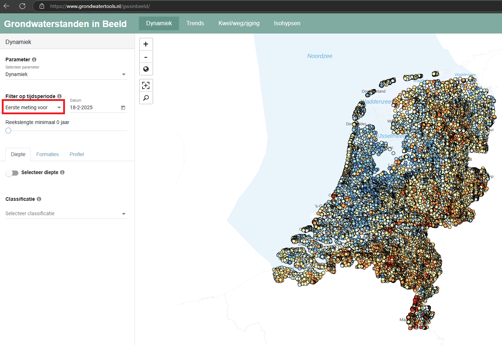
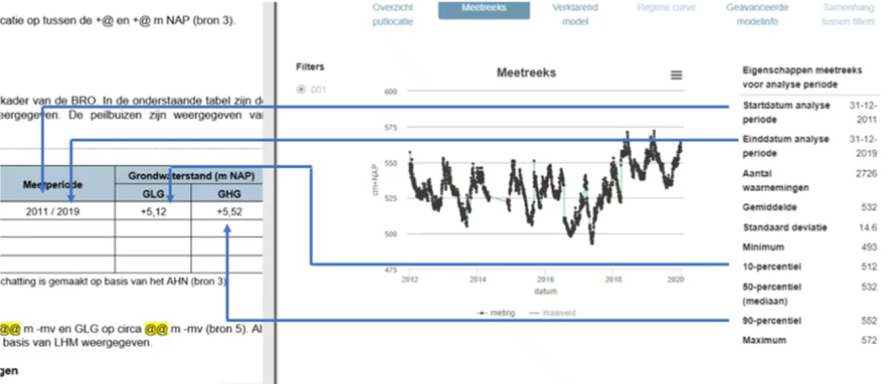

1. Ga naar Grondwaterstanden in Beeld (grondwatertools.nl) https://www.grondwatertools.nl/gwsinbeeld/
2. Vind op basis  van de meegeleverde PDF of het adres de werkzaamheden


 Verberg de peilbuizen door te filteren op “Laatste meeting na” zodat je de kaart goed kan zien, zet ze dan weer aan als je de locatie gevonden hebt.


3. Welke Peilbuizen heb je nodig?
- Neem enkel peilbuizen binnen een straal van á 500m (gebruik evt de meet-functie in Qgis). 
- Neem niet meer dat 6 peilbuizen. Neem wanneer mogelijk peilbuizen langs de gehele lengte van langgerekte werkzaamheden. 
- Bij gelijkaardige peilbuizen of peilbuizen dicht bij elkaar: neem de peilbuis met de meeste, meest doorlopende of meest recente metingen in het “Toon”-venster. 

4. Vul voor de peilbuizen rond de werkzaamheden de tabel in.
- “Peilbuis” is het B-nummer  bijv.: B39H0423
- “Filterstelling” is +<OKF> / +<BKF> bijv.: +3,35 / +3,85
- “Maaiveld” is +<maaiveld>  bijv.: + 6,65
- “Meetperiode” zijn de jaartallen van  “Startdatum analyse periode” en “Einddatum analyse periode” bijv. 2011 / 2019
- “GLG” is de 10-percentiel in meters ipv cm. bijv.: +5.12
- “GHG” is de 90-percentiel in meters ipv cm. bijv.: +5,22 

