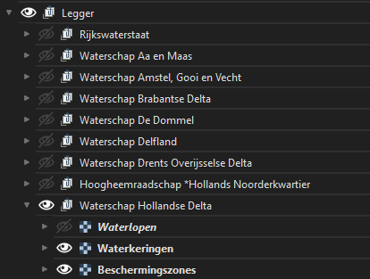
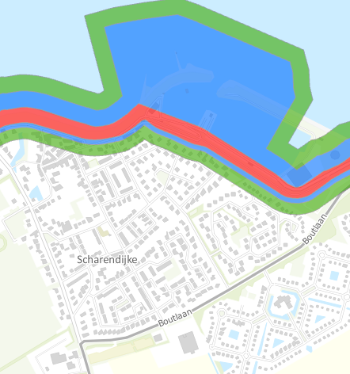

**Grondwaterbeschermingsgebieden en waterkeringen**
- Zoek op in welk waterschap (of waterschappen) de werkzaamheden liggen en zet deze in het Word document
- Zet de laag “Legger”> <waterschap> aan
- Herken of er een gekleurd vlak ligt in binnen 1.000m van de werkzaamheden  en vul dit in als waterkeringsbeschermindszone in het Word document
- Zet de laag “Omgevingsmanagement”>”Grondwaterbeschermingsgebied”> <provincie> aan

- Herken of er een gekleurd vlak ligt in binnen 1.000m van de werkzaamheden  en vul dit in als grondwaterbeschermingsgebied in het Word document,  Vul tevens “1.000” bij “@@meter”

- Als er een “wel” is herkend: ververs het ”Ortageo langwerpig Zonder Overzichtskaart”-venster en verplaats evt. de kaart zodat het gekleurde gebied te zien is.  
- Ga naar “Lay-out”>”Als afbeelding exporteren”
- Plaats de afbeelding in plaats van het logo bij “Afbeelding 1”
- Als beide niet: verwijder afbeelding 2 en de laatste regel van deze alinea
