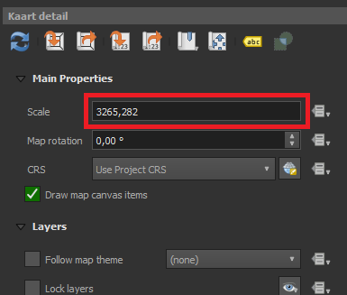
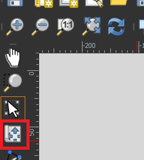
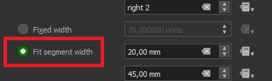
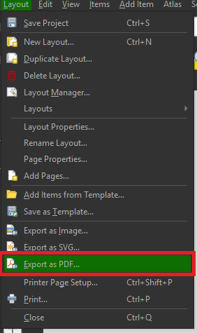

**Kaart Maken**
1. Zet de Kaartlaag Grondwaterstand > [Regio] > GHG aan.
2. Ga naar Project > Layouts en kies een kaart van Ortageo met uitgebreide legenda: Ortageo A3 V3 staand"
3. In het nieuwe venster met de kaart klik in het vak rechts bovenin op Kaart detail
4. Klik op "Kaartbereik instellen op bereik van kaartvenster"
5. De schaal moet naar een "mooie" schaal, dit betekent afonden naar een veelvoud van 250 tot de schaal 1:1500, bij een schaal van meer dan 1:1500 afronden naar een veelvoud van 500.

6. Klik het (hieronder getoonde) knopje links van de kaart en verplaats de kaart om het tracé te centreren.

7. Invullen
- Titel: Voer hier de titel voor de bijlage in, "Verwachte grondwaterstanden GHG"
- Projectnaam: Voer hier de naam van het project zonder project nummer in.
- Projectnummer: Dit is het volgnummer in de memo.
- Opdrachtgever: Het bedrijf dat de opdracht gaf.
- Schaalbalk: Af en toe valt deze buiten de A3, ga dan naar Item Properties en verander het naar "Fixed Segmenth Width" ipv "Fixed width"

8. Nadat het helemaal is ingevuld, ga naar Layout > Export as PDF en sla het op als "Verwachte grondwaterstanden GHG"

9. Zet de kaartlaag voor GLG aan en refresh de Ortageo A3 V3 Staand layout.
10. Vervang GHG met GLG, en exporteer deze ook als PDF op als "Verwachte grondwaterstanden GLG"