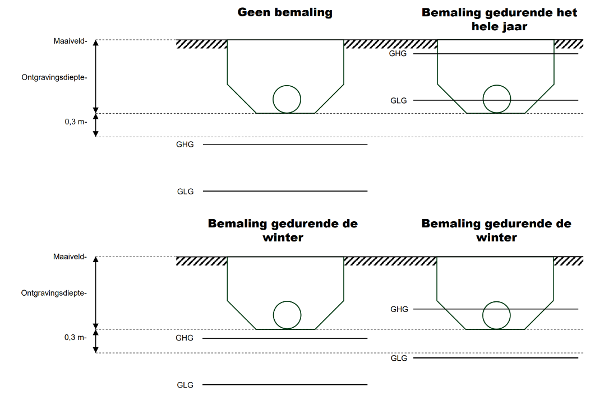

**Conclusies en aanbevelingen invullen**
- Vul de informatie in vanuit de rest van de scan. Inclusief de bronnen. (Provincie, waterschap. Online opzoeken.)

**Bemaling:**
- Laagste GLG  hoger dan de graaf-diepte = “wel”
- Hoogste GHG lager dan de graaf-diepte = “niet”
- Anders = “in de winter”

**Aanbevelingen:**
- Verwijder evt. de alinea over bemalingen.
- Verwijder evt. de 2 alinea’s over beschermingsgebieden
